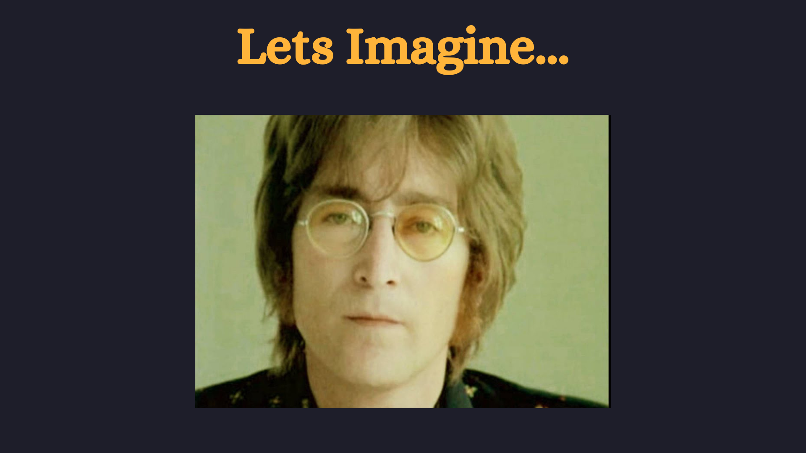
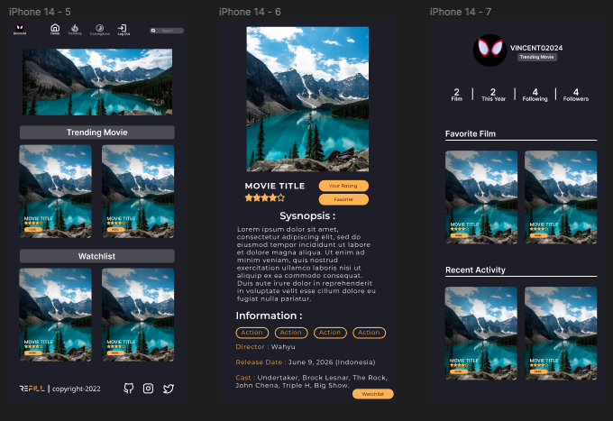
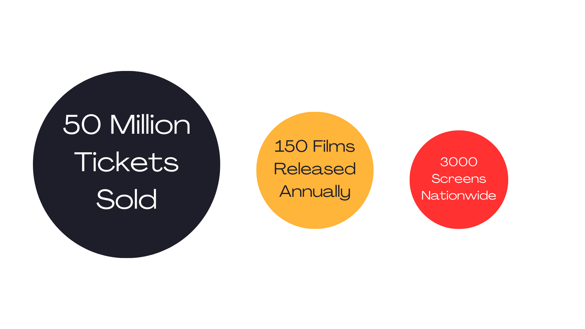
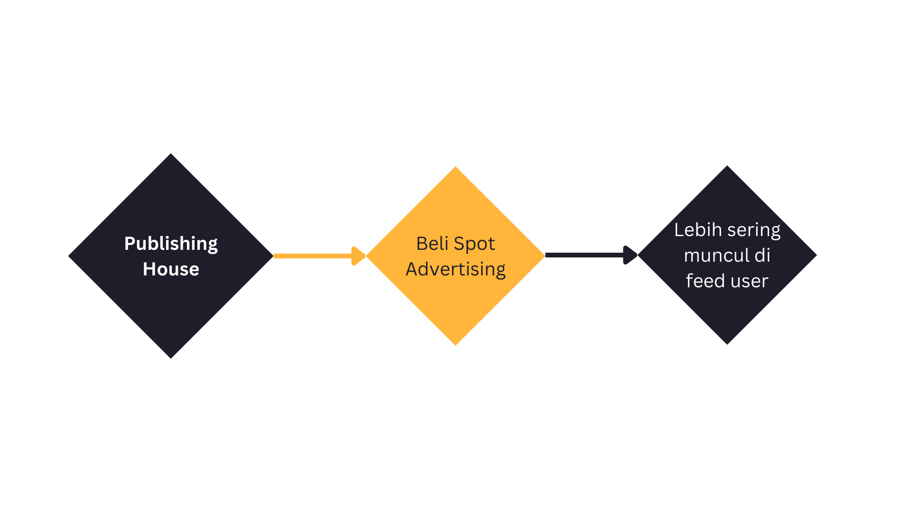
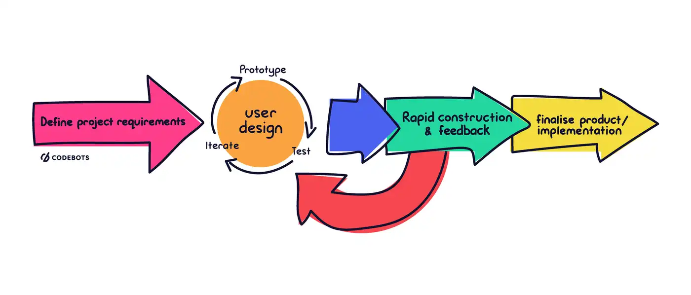
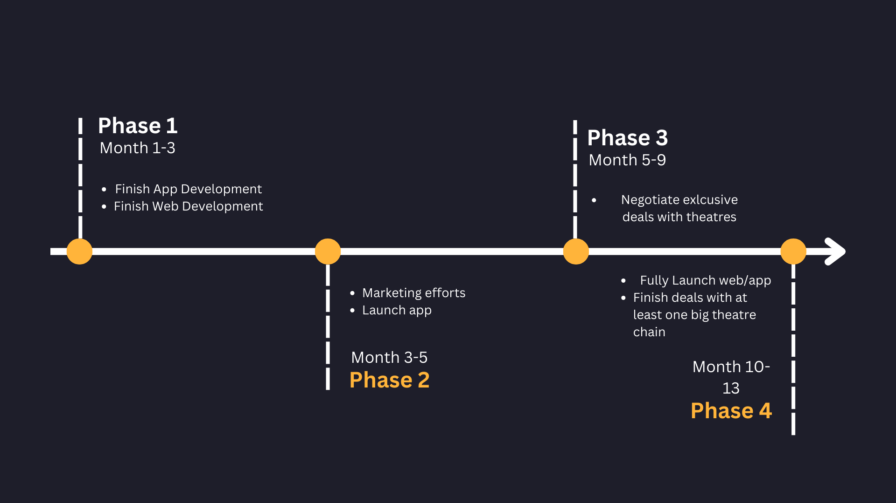
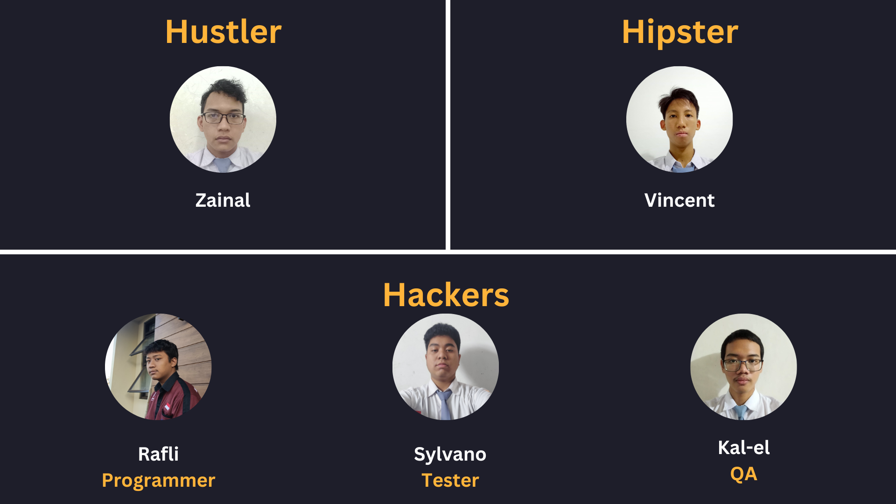

Review-Watch-ReFill

---

## *Problem*

---

<!--
Mari kita bayangkan suatu skenario, mungkin teman atau mungkin pasangan, mengajak kita untuk keluar bareng. Ada banyak kegiatan yang bisa kita lakukan kan? ke kafe, mabar, atau jika ada duitnya, nonton. Tapi pertanyaan paling pertama adalah... Mau nonton apa? lagi ada film apasih sih? itu adalah fondasi permasalah utama kami, dan solusi untuk masalah itu adalah...
-->

---

## *Solution*

---

**Tix Id + letterboxd = ReFill**

<!--
Pergabungan antara aplikasi komunitas cinephiles letterboxd dengan fitur pembelian tiket seperti tix id 
-->

---

<!--
ReFill akan menjadi aplikasi "all-in-one for cinema", dimana fitur review/sosial media akan membuat user lebih terbuka kepada release film film baru, dan setelah itu mereka tinggal membeli tiket di dalam aplikasi yang sama
-->

---

## *Target Customer*

---

1. Casual to Cinephiles
2. Individual to Collective

<!-- 
Bioskop bergantung pada 2 customer base utama, casual atau cinephiles, individual atau collective. Casual dan cinephile adalah polar opposite dari satu sama lain, dimana yang satu menonton untuk kesenangan sendiri, cinephile bisa dibilang orang-orang yang lebih mendalemi dunia perfileman secara media artistik. Sama juga untuk individual dan collective, kami  
-->

---

## *Market Sizing*

---

<!-- 
50 Juta tiket bioskop terjual pada tahun 2018,
150 film terrelease pada tahun 2019,
sekitar 3000 layar dalam 300 bioskop di seluruh indonesia. Bayangkan berapa banyak lagi statistik ini akan berubah pada 5-10-15 tahun kedepan, dengan asumsi bahwa stabilitas dan ekonomi tetap mengalami kemajuan seperti sekarang, atau bahkan lebih. Kita melihat pada untapped market pada industry yang sangat tua pada era yang baru.
-->

---

## *Competition Landscape*

---

<!--
Tix id dan letterboxd menjadi sumber inspirasi utama aplikasi kami, karena itu mereka menjadi kompetitor utama kami untuk memasuki market tersebut. Fitur social media letterboxd dengan fitur pembelian ticket tix id
-->

---

## *Business Model*

---

- Ticket Sales
- Advertisement

---

<!--
Walau ticket sales akan menjadi kontributor penting pada revenue kami, sebenarnya sisi advertisement yang akan menjadi jalan utama untuk penghasilan revenue dalam jangka panjang.
-->

---

## *Technology*

---

## Flutter

- Mutli Platform
- Single Code base
- Industry standard for multi platform apps

---

## Firebase

- Backend as a service
- Easy to start off with
- Low cost starting off

---

---

## *Objective and Strategy*

---

---

---

## *Team*

---

---

## *Why Us*

---

## 🔥 Passion 🔥

---

## Thank you
